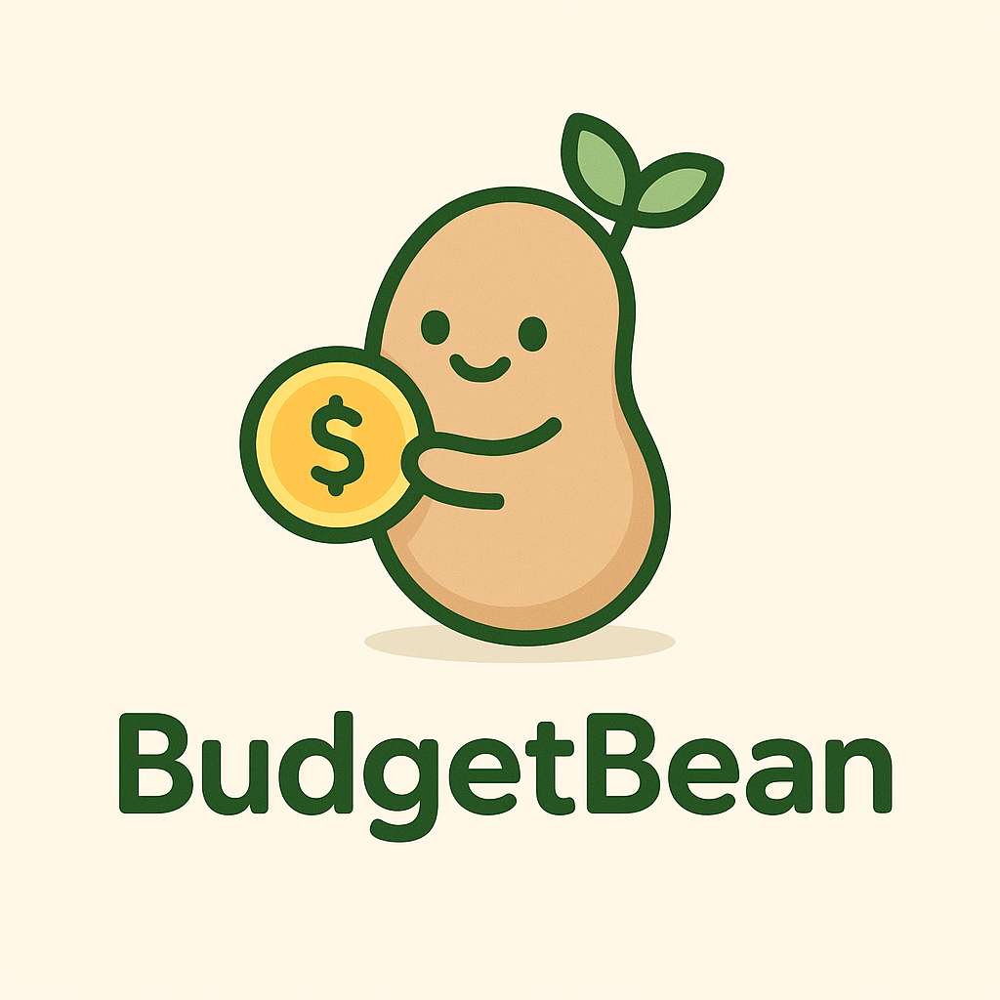
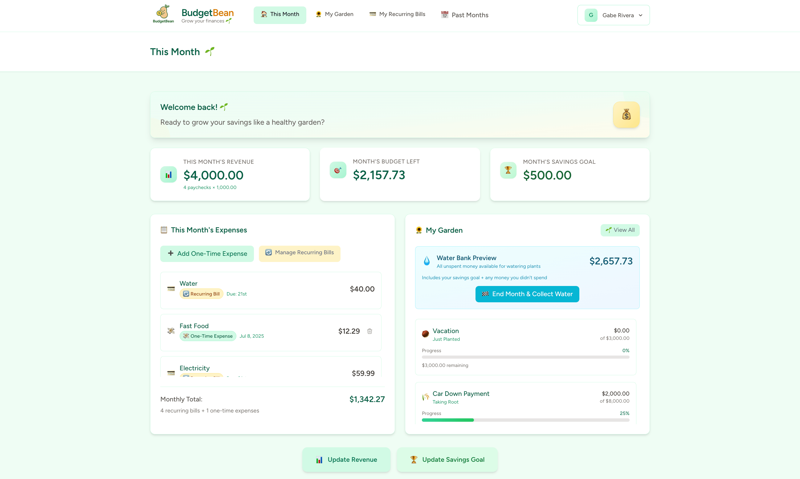
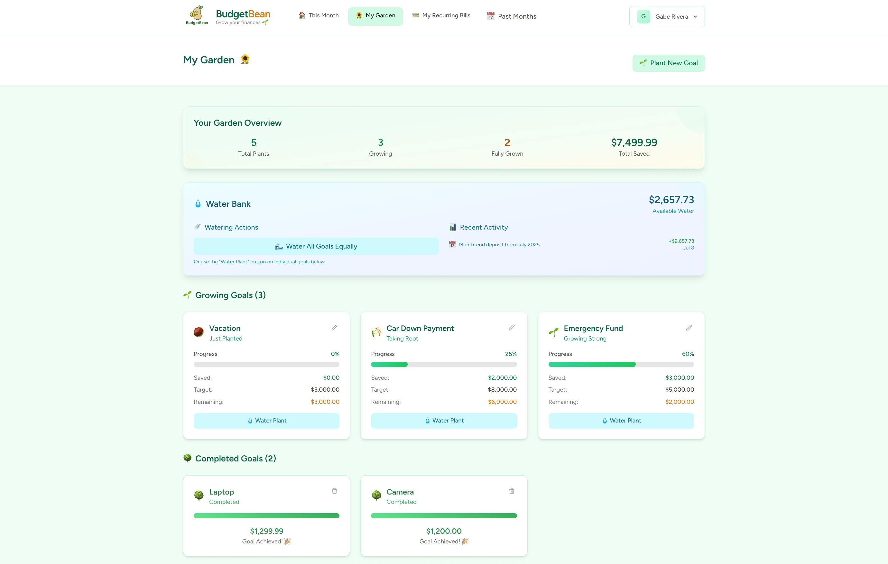
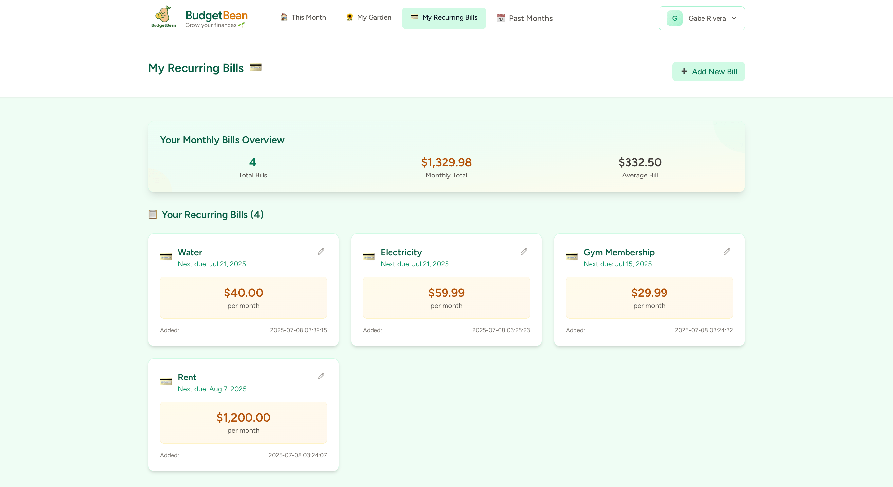
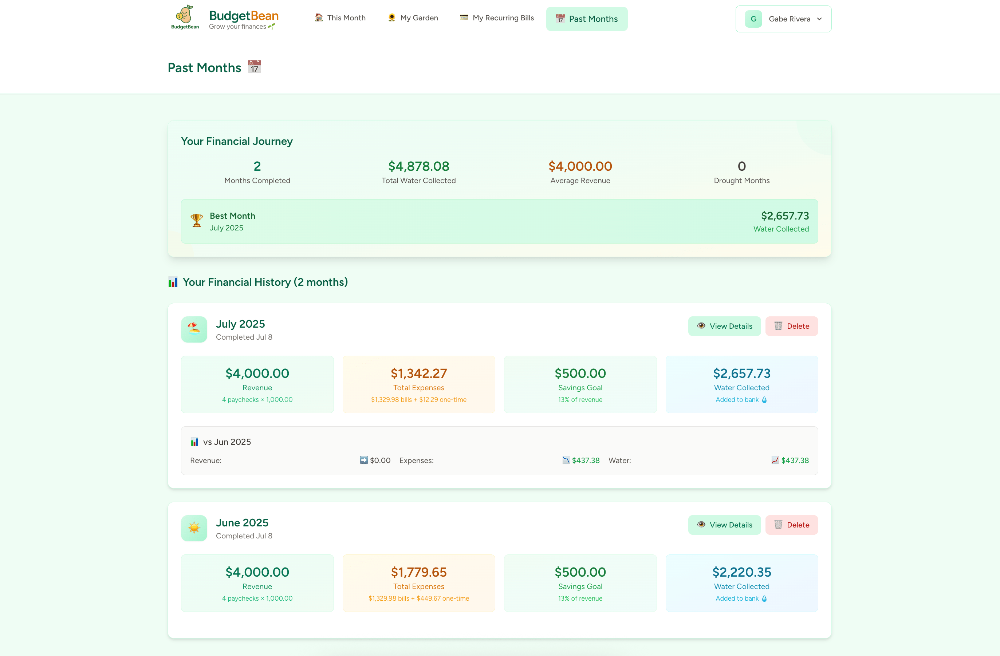
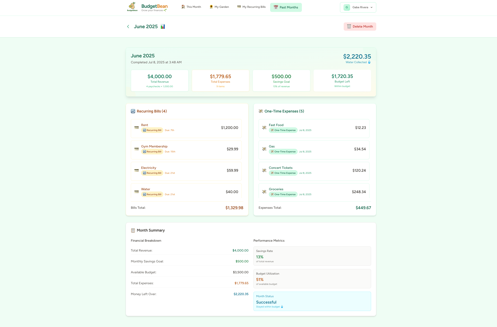
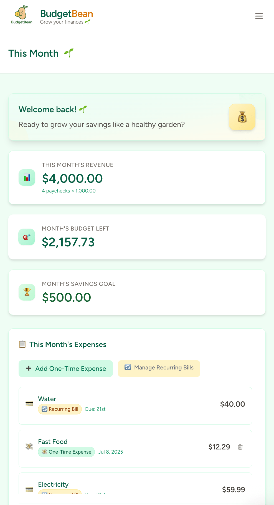

# BudgetBean 🌱

*Growing your financial future, one bean at a time.*

<div>

</div>

**BudgetBean** is a gamified personal finance management application that transforms budgeting from a chore into a delightful garden-tending experience. Watch your savings goals grow from tiny seeds 🌰 into flourishing trees 🌳 as you nurture your financial health.

## 🚀 **[► CLICK TO TRY BUDGETBEAN LIVE ◄](https://budgetbean.riveragabriel.com)** 🌱

👆 Click above to experience the full application - test features without registration! 🌱

[](https://laravel.com)
[](https://php.net)
[](https://vuejs.org)
[](https://inertiajs.com)
[](https://tailwindcss.com)
[](https://laravel.com/docs/sail)
[](https://phpunit.de)

## 🌟 Why BudgetBean?

Traditional budgeting apps are boring and feel like homework. BudgetBean makes financial management **engaging** and **intuitive** through:

- **🌱 Plant Metaphor**: Savings goals grow like plants - from seeds to full trees
- **💧 Water Bank System**: Unspent money becomes "water" to fund your goals
- **🏜️ Drought Protection**: Visual feedback when you're overspending
- **📊 Beautiful Analytics**: Track your financial growth over time
- **🎮 Gamified Experience**: Makes budgeting actually enjoyable

## 📸 Screenshots

### 🌱 This Month - Main Dashboard
<div>

</div>
*Main dashboard showing monthly revenue, expenses, budget status, and savings goals overview*

### 🌻 My Garden - Savings Goals
<div>

</div>
*Savings goals visualized as growing plants with water bank system for funding goals*

### 💳 Recurring Bills Management
<div>

</div>
*Comprehensive recurring bills tracking with due dates and monthly totals*

### 📊 Financial History & Analytics
<div>

</div>
*Historical tracking with month-over-month growth analysis and performance metrics*

### 📈 Detailed Month Analysis
<div>

</div>
*Deep dive into individual month performance with expense breakdowns and growth comparisons*

### 📱 Mobile-Optimized Experience
<div>

</div>
*Fully responsive design optimized for mobile devices - same powerful features on any screen*

---

*Screenshots demonstrate realistic financial data - this isn't just a portfolio piece, it's a working application I actively use and improve! 🌱*

## ✨ Key Features

### 💰 Smart Financial Tracking
- **Flexible Revenue Input**: Paycheck calculator or custom amounts
- **Dual Expense Types**: Recurring bills + one-time expenses
- **Monthly Cycles**: Complete months to collect leftover money as "water"

### 🌻 Gamified Savings Goals
- **Visual Plant Growth**: Goals evolve from 🌰 → 🌱 → 🌿 → 🌳 based on progress
- **Water Bank Funding**: Use collected water to fund multiple goals
- **Smart Watering**: Automatically prevents over-funding completed goals

### 📈 Comprehensive Analytics
- **Historical Tracking**: Complete month-by-month financial history
- **Growth Comparisons**: See month-over-month improvements
- **Drought Detection**: Visual warnings when overspending

### 🎯 User Experience
- **Guest Mode**: Try the app without registration
- **Responsive Design**: Beautiful on desktop and mobile
- **Intuitive Interface**: Clean, modern design with helpful emojis

## 🛠️ Technology Stack

**Backend**
- **Laravel 12**: Latest PHP framework with cutting-edge features
- **PHP 8.4**: Modern PHP with performance improvements
- **Repository Pattern**: Clean separation of data access logic
- **Service Layer**: Business logic abstraction
- **DTOs**: Type-safe data transfer objects
- **Custom Exceptions**: Proper error handling
- **Comprehensive Testing**: Feature tests with PHPUnit

**Frontend**
- **Vue.js 3**: Reactive JavaScript framework with Composition API
- **Inertia.js 2.0**: SPA-like experience without API complexity
- **TailwindCSS 3**: Utility-first CSS framework
- **Vite**: Fast build tool for modern development

**Development & DevOps**
- **Laravel Sail**: Dockerized development environment
- **Custom Makefile**: Streamlined developer workflow
- **MySQL 8.0**: Robust database with modern features
- **Git Workflow**: Professional version control practices

**Architecture Highlights**
- **Dual Storage Strategy**: Database for users, sessions for guests
- **Clean Code Principles**: SOLID principles, dependency injection
- **Type Safety**: Readonly data classes and strict typing
- **Test-Driven Development**: Comprehensive feature and unit tests
- **Containerized Development**: Docker for consistent environments

## 🚀 Installation

### Prerequisites
- Docker & Docker Compose
- PHP 8.4+ (if running locally)
- Composer
- Node.js & NPM

### Quick Start with Laravel Sail (Recommended)

1. **Clone the repository**
   ```bash
   git clone https://github.com/riveragabrielcs/budget-bean
   cd budgetbean
   ```

2. **Copy environment file**
   ```bash
   cp .env.example .env
   ```

3. **Install dependencies and start containers**
   ```bash
   # Using the custom Makefile (recommended)
   make install  # Installs PHP & Node dependencies
   make up       # Starts Docker containers
   make migrate  # Runs database migrations
   
   # Or manually with Sail
   ./vendor/bin/sail up -d
   ./vendor/bin/sail artisan migrate
   ```

4. **Access the application**
    - **Web Application**: http://localhost
    - **Mailpit (Email Testing)**: http://localhost:8025

### Developer Workflow (Using Makefile)

The project includes a comprehensive Makefile for streamlined development:

```bash
# Development
make help          # Show all available commands
make dev           # Start all services (app, queue, logs, vite)
make logs          # View container logs
make shell         # Access application container

# Database
make migrate       # Run migrations
make fresh         # Fresh database with seeders
make seed          # Run database seeders

# Testing
make test          # Run PHPUnit tests
make test-coverage # Run tests with coverage

# Frontend
make npm-dev       # Development build with watch
make npm-build     # Production build

# Cleanup
make clean         # Clear caches and rebuild
make reset         # Complete reset with fresh install
```

### Manual Installation (Without Docker)

If you prefer running locally without Docker:

1. **Install dependencies**
   ```bash
   composer install
   npm install
   ```

2. **Environment setup**
   ```bash
   cp .env.example .env
   php artisan key:generate
   ```

3. **Configure database and run migrations**
   ```bash
   php artisan migrate
   ```

4. **Build assets and start**
   ```bash
   npm run build
   php artisan serve
   ```

### Environment Configuration

Key environment variables to configure:

```bash
# Database
DB_CONNECTION=mysql
DB_HOST=mysql        # Use 'mysql' for Sail, '127.0.0.1' for local
DB_PORT=3306
DB_DATABASE=budgetbean
DB_USERNAME=sail
DB_PASSWORD=password

# Application
APP_NAME=BudgetBean
APP_ENV=local
APP_URL=http://localhost
```

## 🎮 Usage Examples

### Creating Your First Savings Goal
```php
// The app guides you through creating goals with beautiful UI
1. Navigate to "My Garden" 🌻
2. Click "Plant Your First Goal" 🌱  
3. Set name, target amount, and description
4. Watch your seed appear in the garden!
```

### Monthly Workflow
```php
1. Set your monthly revenue 📊
2. Add recurring bills 💳
3. Track one-time expenses 💸
4. End the month to collect water 💧
5. Use water to grow your savings goals 🌱→🌳
```

### Water Bank System
```php
// Unspent money becomes "water" for your goals
Monthly Budget = Revenue - Savings Goal - Expenses
Leftover Money = Water for Goals 💧

// Smart watering prevents waste
if (goal.current_amount >= goal.target_amount) {
    // Automatically prevents over-watering
    return "Goal already completed! 🌳 "
}
```

## 📁 Project Structure

```
app/
├── Data/              # Readonly data transfer classes
├── DTOs/              # Data transfer objects with methods
├── Enums/             # Type-safe enumerations
├── Exceptions/        # Custom application exceptions
├── Http/
│   ├── Controllers/   # Request handling logic
│   ├── Requests/      # Form validation classes
│   └── Resources/     # API resource transformations
├── Models/            # Eloquent database models
├── Repositories/      # Data access abstraction
│   ├── Bill/          # Bill-specific repositories
│   ├── Expense/       # Expense management
│   ├── Revenue/       # Revenue tracking
│   ├── SavingsGoal/   # Savings goal operations
│   └── WaterBank/     # Water bank transactions
└── Services/          # Business logic layer
    ├── BillService.php
    ├── DashboardService.php
    ├── ExpenseService.php
    ├── PlantGrowthService.php
    ├── RevenueService.php
    ├── SavingsGoalService.php
    └── WaterBankService.php

resources/js/
├── Components/        # Reusable Vue components
├── Layouts/          # Application layouts
├── Pages/            # Inertia.js page components
└── Composables/      # Vue composition utilities
```

## 🏗️ Architecture Decisions

### Repository Pattern
Implemented to abstract data access and enable easy testing:
```php
interface BillRepositoryInterface {
    public function forUser(?User $user): Collection;
    public function create(?User $user, BillData $data): BillDTO;
    // ... other methods
}
```

### Dual Storage Strategy
- **Authenticated users**: Full database persistence
- **Guest users**: Session-based storage for demo experience
- **Seamless experience**: Same interface for both user types

### Service Layer
Business logic separated from controllers:
```php
class WaterBankService {
    public function waterGoal(User $user, int $goalId, WaterGoalData $data): array
    {
        $goal = $this->findGoalOrFail($user, $goalId);
        $waterCalculation = $this->calculateWaterUsage($goal, $data->amount);
        // ... smart watering logic
    }
}
```

## 🤝 Contributing

I built this as a personal project, but I'm open to contributions! Here's how you can help:

1. **Fork the repository**
2. **Create a feature branch** (`git checkout -b feature/amazing-feature`)
3. **Commit your changes** (`git commit -m 'Add amazing feature'`)
4. **Push to the branch** (`git push origin feature/amazing-feature`)
5. **Open a Pull Request**

### Development Guidelines
- Follow PSR-12 coding standards
- Write meaningful commit messages
- Add tests for new features
- Update documentation as needed

## 🧪 Testing

BudgetBean includes comprehensive test coverage for critical business logic, particularly the complex water bank system that prevents over-funding of savings goals.

### Running Tests

```bash
# Using Makefile (recommended)
make test                    # Run all tests
make test-coverage          # Run with coverage report
make test-filter FILTER=WaterGoal  # Run specific tests

# Using Sail directly
./vendor/bin/sail test
./vendor/bin/sail test --coverage
./vendor/bin/sail test --filter=WaterGoalServiceTest
```

### Test Architecture

The application follows a multi-layer testing approach:

**Service Layer Tests**
- `WaterGoalServiceTest`: Core business logic for smart watering
- Tests complex scenarios like overwatering prevention
- Validates financial calculations and edge cases

**HTTP Integration Tests**
- `HttpWaterGoalTest`: End-to-end HTTP request testing
- `GardenWaterTest`: Frontend route integration testing
- Ensures proper error handling and session management

**Key Test Scenarios**
```php
// Example: Preventing overwatering through smart calculation
public function it_prevents_overwatering_through_garden_add_savings_route()
{
    // User has $2000 in water bank
    // Goal needs only $100 to complete
    // User tries to add $200
    
    // Result: Only $100 is used, $1900 remains in bank
    $this->assertEquals(1900.00, $finalBalance);
}
```

### Test Coverage Highlights

- **Financial Logic**: Water bank calculations, goal completion
- **Error Handling**: Insufficient funds, invalid goals, security
- **Business Rules**: Overwatering prevention, smart allocation
- **Integration**: HTTP routes, session handling, database transactions

## 📄 License

**Educational & Portfolio Purposes Only**

This project is made publicly available for **portfolio demonstration and educational purposes only**. The source code may be viewed for review but is not licensed for reuse, distribution, or modification.

### ✅ You May:
- View and study the code for learning purposes
- Reference architectural patterns and implementation techniques
- Use small code snippets for educational examples (with attribution)
- Fork for experimentation and learning (not redistribution)

### ❌ You May Not:
- Use this project commercially or in production
- Redistribute, sell, or sublicense the code
- Deploy your own instance for public use
- Remove or modify copyright notices
- Claim ownership of the codebase

### 🤝 Want to Use Something?
If you'd like to use any part of this project for commercial purposes, educational materials, or have questions about implementation details, feel free to reach out! I'm happy to discuss permissions and potential collaboration.

**Contact**: riveragabrielcs@gmail.com

---

*This code represents significant personal time and effort invested in creating a unique solution. Thank you for respecting these terms while exploring the project!*

## 🌱 About the Creator

Hi! 👋 I'm Gabe Rivera, a full-stack developer passionate about creating applications that solve real problems in creative ways. BudgetBean started as a personal need. I wanted a budgeting app that celebrated financial wins and made tracking progress as satisfying as watching plants grow.

**Why this project showcases my skills:**
- **Full-stack development**: Laravel backend + Vue.js frontend
- **Clean architecture**: Repository pattern, service layer, proper abstractions
- **User experience focus**: Gamification, responsive design, accessibility
- **Real-world application**: I actually use this to manage my finances!
- **Creative problem-solving**: Unique plant metaphor makes budgeting engaging

### Connect with me:
- **GitHub**: [riveragabrielcs](https://github.com/riveragabrielcs)
- **LinkedIn**: [Gabriel Rivera's Profile](https://www.linkedin.com/in/gabriel-rivera-cs/)
- **Email**: riveragabrielcs@gmail.com
- **Portfolio**: [Gabe's Portfolio](https://riveragabriel.com)

---

**Made with 💚 and lots of ☕ by Gabe Rivera**

*Start growing your financial future today! 🌱→🌳*
